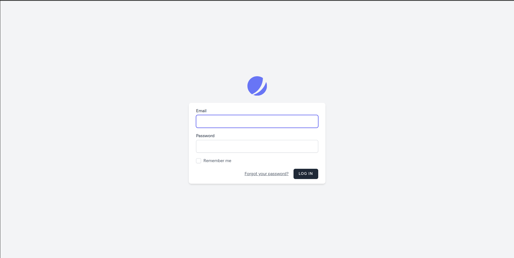
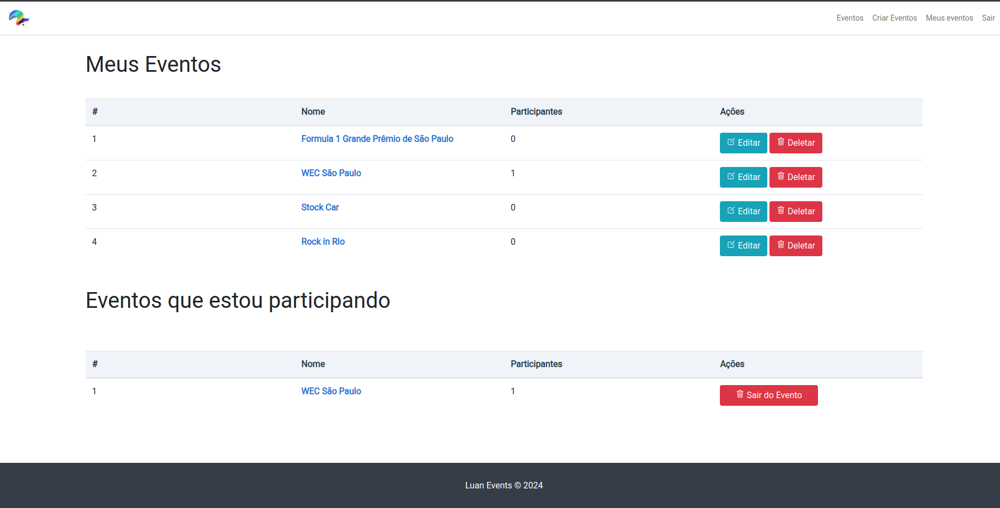
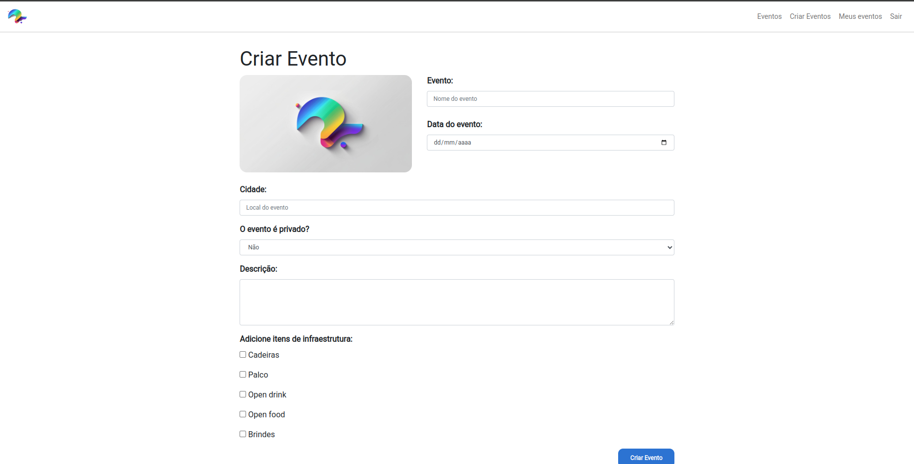
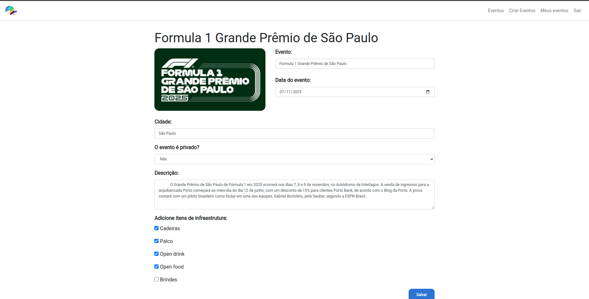

# Sistema Laravel 11 com Jetstream e Livewire

Este projeto é um exemplo de sistema web desenvolvido em **Laravel 11** com **Jetstream (Blade + Tailwind CSS)** e **Livewire 3**, usando **SQLite** como banco de dados.

---

## 🛠 Tecnologias utilizadas

- Laravel 11
- PHP 8.2+
- Jetstream 5 (Blade + Tailwind)
- Livewire 3
- SQLite (arquivo local)
- Laravel Tinker, PHPUnit, FakerPHP, Mockery
- Laravel Sail (Docker dev) e Laravel Pint

---

## ✅ Funcionalidades

- Autenticação de usuários (login, registro, logout)
- Recuperação e verificação de e-mail
- Sessão persistente ("remember me")
- Validações de formulários
- Layout responsivo
- Componentes dinâmicos com Livewire
- CRUD completo de eventos

---

## 📸 Telas do Sistema

- **Login / Registro**
<p align="center">

</p>


- **Dashboard Principal**
<p align="center">
  
</p>

- **Listagem de Eventos**
<p align="center">
  
</p>

- **Cadastro de Evento**
<p align="center">
  
</p>

- **Edição de Evento**
<p align="center">
  
</p>

## ⚙️ Como rodar localmente

1. Clone o repositório:
```bash
git clone https://github.com/luangoularte/Luan-Events.git
cd Luan-Events
```
2. Instale as dependências:
```bash
composer install
npm install && npm run dev
```
3. Configure o .env:
```bash
cp .env.example .env
php artisan key:generate

- Configure SQLite no .env:
    DB_CONNECTION=sqlite
    DB_DATABASE=./database/database.sqlite

- Crie o arquivo do banco, se não existir:
    touch database/database.sqlite
```
4. Rode as migrations:
```bash
php artisan migrate
```
5. Inicie o servidor local:
```bash
php artisan serve

Acesse o sistema em http://127.0.0.1:8000
```